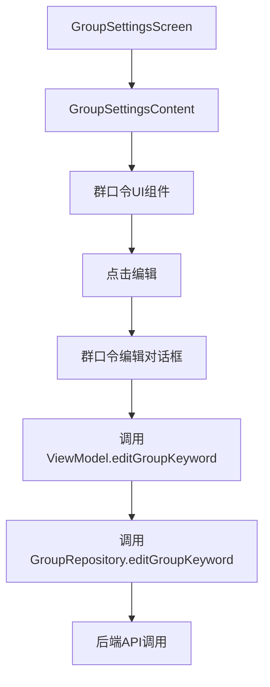

# 群口令访问权限修改设计文档

## 概述

本设计文档描述了如何修改群聊设置中的群口令功能，移除权限限制，让所有群成员都能查看和编辑群口令。

## 当前实现分析

### 现有权限控制机制

当前在 `GroupSettingsScreen.kt` 中，群口令功能被包装在权限检查中：

```kotlin
// 群口令（仅群主可见和编辑）
if (groupInfo.ownerId == viewModel.getCurrentUserId()) {
    // 群口令UI组件
}
```

### 现有功能组件

1. **UI组件**：群口令显示和编辑对话框
2. **ViewModel方法**：`editGroupKeyword()` 方法处理群口令修改
3. **Repository方法**：`GroupRepository.editGroupKeyword()` 调用后端API

## 设计方案

### 核心修改

#### 1. 移除UI层权限检查

将群口令UI组件从权限检查条件中移出，让所有用户都能看到：

```kotlin
// 修改前
if (groupInfo.ownerId == viewModel.getCurrentUserId()) {
    // 群口令UI
}

// 修改后
// 直接显示群口令UI，无权限检查
```

#### 2. 保持现有编辑逻辑

保留现有的 `editGroupKeyword` 方法和对话框逻辑，因为这些功能已经完善：

- 群口令编辑对话框
- 输入验证和加载状态
- 成功/失败处理
- 自动刷新群信息

### 实现细节

#### UI层修改

在 `GroupSettingsContent` 组件中：

1. 移除 `if (groupInfo.ownerId == viewModel.getCurrentUserId())` 条件判断
2. 保持群口令显示和编辑的完整UI逻辑
3. 确保所有群成员都能看到群口令设置项

#### 代码结构



### 边界情况处理

| 场景 | 处理方式 | 代码位置 |
|------|----------|----------|
| 群口令为空 | 显示"未设置"状态 | GroupSettingsScreen.kt:289 |
| 网络请求失败 | 显示错误信息，保持对话框打开 | GroupSettingsViewModel.kt:304-310 |
| 用户取消编辑 | 关闭对话框，不保存更改 | GroupSettingsScreen.kt:344-348 |
| 保存成功 | 关闭对话框，刷新群信息 | GroupSettingsViewModel.kt:300-302 |

## 技术实现

### 修改范围

1. **主要文件**：`GroupSettingsScreen.kt` (第269-352行)
2. **修改类型**：移除条件判断，保持现有逻辑
3. **影响范围**：仅UI显示逻辑，不影响后端API

### 兼容性

- 后端API `editGroupKeyword` 保持不变
- ViewModel 方法保持不变  
- 其他群设置功能不受影响

## 验证方案

1. **功能验证**：确认所有群成员都能看到群口令设置
2. **编辑验证**：确认群口令编辑功能正常工作
3. **错误处理验证**：确认网络错误等异常情况处理正确